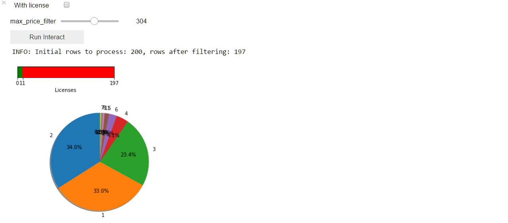
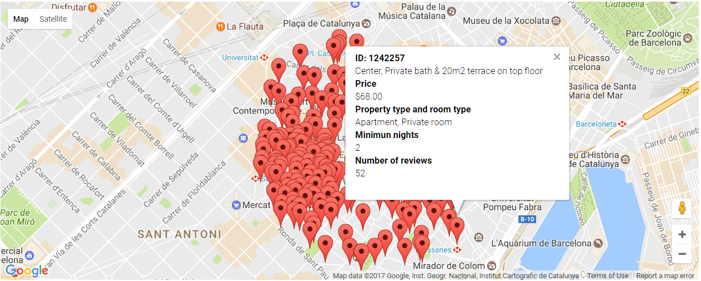

# Data-Science

## AirbnbBarcelona (v1.0)
Show data obtained from insideairbnb.com using some matplotlib figures and [gmaps library from pbugnion](https://github.com/pbugnion/gmaps). Additionaly there are some filters in order to filter by price and/or license.

### Things to do
- To group "minimun_nights" pie chart in order to avoid overlapping text.
- Avoid ```divide by zero RuntimeWarning```, [bug reported](https://github.com/matplotlib/matplotlib/issues/8534).
- Show color from colorbar correctly when license filter applied (it's showing like empty bar instead of full bar).

### Possible features to add
- Preview images from apartments in gmaps.

### Screenshots




